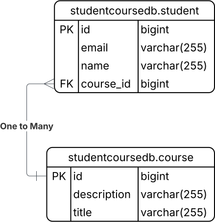

# 🎓 Student-Course Management Application

A modern Java Spring Boot web application for managing Students and Courses with a relational database, intuitive UI, and comprehensive features.

---

## 🚀 Features

- **CRUD for Students and Courses**
- **Many-to-One relationship:** Each student is enrolled in one course, each course may have many students
- **Sample dataset:** Bengali student names, curated course list
- **Modern UI:** Responsive, clean tables and forms, error cards, and navigation
- **Validation & Constraints:** Prevent deleting courses that have students enrolled
- **Comprehensive Testing:** JUnit & Mockito coverage
- **Clear error messages** for better UX

---

## 🔗 Entity Relationship

---

## 🛠 Tech Stack

- **Spring Boot 2.7.x**
- **Spring Data JPA / Hibernate**
- **MariaDB (main), H2 (testing)**
- **JSP, JSTL, Custom CSS**
- **JUnit 5, Mockito**
- **Maven**

---

## 📦 Installation & Usage

1. **Clone the Repo**
   git clone https://github.com/srtkmaji/studentcourseapp.git
   cd studentcourseapp

2. **Setup MySQL Database**
CREATE DATABASE studentcoursedb;

Update your `src/main/resources/application.properties` credentials.

3. **Run**
   ./mvnw clean install
   ./mvnw spring-boot:run

4. **Open in Browser**

- [http://localhost:8080/students](http://localhost:8080/students)
- [http://localhost:8080/courses](http://localhost:8080/courses)

5. **Run Tests**
   ./mvnw test

---

## 💡 Key Implementation Notes

- **Course delete is protected:** Cannot delete a course if students are enrolled; user sees an error card explaining the constraint.
    
- **Modern UI:** Custom CSS with “Merriweather” font, responsive tables, forms, cards, and navigation bar.
- **Consistent UX:** Friendly validation, error handling, and safe redirects.

---

## 🧪 Tests

- Repository and service layer unit/integration tests in `/src/test`
- H2 used for tests for speed and isolation

---

## 🏆 Challenges & Solutions

- **Foreign Key Constraint:** Handled with error card and backend catch.
- **JSTL Error:** Fixed by using `<c:forEach>` not `<c:foreach>`
- **Test Environment:** Added H2/JUnit/Mockito dependencies for robust testing.

---

## 👤 Author

Developed by **Sarthak Maji**  
[GitHub Profile](https://github.com/srtkmaji)

---
